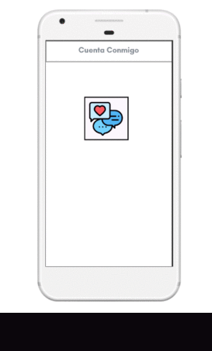
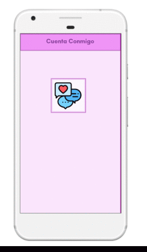

# Proyecto Red Social CountOnMe.App :computer:
## **Proceso de UX**

## Sketching de Diseño esperado o ideal (Baja fidelidad).
- Mobile first + Desktop

#### Blanco y negro

#### Probando con colores

# DEFINICION DEL PRODUCTO

**El embarazo en adolescentes es un fenómeno que ha cobrado importancia en los últimos años debido a que México ocupa el primer lugar en el tema, entre los países de la Organización para la Cooperación y el Desarrollo Económico (OCDE) con una tasa de fecundidad de 77 nacimientos por cada mil adolescentes de **15 a 19 años de edad**. **Asimismo, en México, 23% de las y los adolescentes inician su vida sexual entre los 12 y los 19 años**. De estos, 15% de los hombres y 33% de las mujeres no utilizaron ningún método anticonceptivo en su primera relación sexual. Es así que de acuerdo con estos datos, aproximadamente ocurren al año 340 mil nacimientos en mujeres menores de 19 años**.

El embarazo en las y los adolescentes afecta negativamente la salud, la permanencia en la escuela, los ingresos presentes y futuros, el acceso a oportunidades recreativas, sociales y laborales especializadas y de calidad y el desarrollo humano. Además del embarazo, tener relaciones sexuales sin protección implica un riesgo permanente de adquirir una infección de transmisión sexual.

**Es por ello que se ha decidido crear esta aplicacion movil  para la asesorar y apoyar a jovenes   aolescentes embarazadas , y brindar un espacio donde puedan tocar varios temas de su interes con personas experiemtadas y conocedoras del tema,ademas de que podran hablar con otras jovenes de su edad y compratir sus vivencias ,permitiendo asi crear un espacio de confianza y apoyo.**

# BENCHMARK
#### Para elaborar esta tabla de comparacion se tomo en cuenta las aplicaciones que existen sobre temas de educacion sexual para adolescentes.
#### Haciendo una comparativa entre todas ellas Los resultados se muestran a continuacion :

Nombre app mobile |           CREsI      |
-------------     | ---------------------|
Nombre app mobile |Cresi                 |
Pais de Origen    |Argentina             |
Selección Idiomas |si                    |
Interactiva       |si                    |
Intuitiva         |si                    |
Gratuita          |si                    |
Descargas         |5,000                 |
Android           |si                    |
Itunes            |no                    |
Juego             |si                    |
Edad Minima       |12                    | 

Nombre app mobile |Se como Jose y Josefa |
-------------     | ---------------------|
Nombre app mobile |Se como Jose y Josefa |
Pais de Origen    |Madrid España         |
Selección Idiomas |Español               |
Interactiva       |si                    |
Intuitiva         |si                    |
Gratuita          |si                    |
Descargas         |1,000                 |
Android           |si                    |
Itunes            |no                    |
Juego             |si                    |
Edad Minima       |------                | 

Nombre app mobile |No te adelantes       |
-------------     | ---------------------|
Nombre app mobile |No te adelantes       |
Pais de Origen    |Baja California       |
Selección Idiomas |Español               |
Interactiva       |si                    |
Intuitiva         |si                    |
Gratuita          |si                    |
Descargas         |-----                 |
Android           |no                    |
Itunes            |si                    |
Juego             |si                    |
Edad Minima       |------                | 

Nombre app mobile |Sex Education         |
-------------     | ---------------------|
Nombre app mobile |Sex Education         |
Pais de Origen    |----------            |
Selección Idiomas |Español               |
Interactiva       |si                    |
Intuitiva         |si                    |
Gratuita          |si                    |
Descargas         |1,000                 |
Android           |si                    |
Itunes            |no                    |
Juego             |si                    |
Edad Minima       |17+                   | 

# RESUMEN DE ENTREVISTAS DE USUARIO

Se elaboro una entrevista para poder saber la opinion sobre este tema.
Las Entrevistas se realizaron a mujeres de diferentes edades.Para asi abordar varios puntos de vista.

(https://ana1563.typeform.com/to/mBtGLx)

## Análisis argumentativo de la elección de la Red Social

Audio de la entrevista con nuestro cliente, primer contacto:
 [Propuesta ante cliente](https://drive.google.com/drive/folders/18EQK_W0VwR8XwphCerMWz2ONYNA98P0K?usp=sharing)

 Es importante mencionar que las redes sociales han tenido un gran impacto en la sociedad en un ámbito global, y  la mayoría de los usuarios son específicamente jóvenes, recordemos que cada red social cumple cierta finalidad.
Al crear una red social (CountOnMe.App) comunitaria de apoyo dirigida a mujeres sin importar edad o situación económica, se pretende crear un espacio de convivencia humana donde prevalece el trato igualitario y el respeto mutuo. Al compartir experiencias propias  o vivencias con personas que en su adolescencia tuvieron el proceso de un embarazo y lo que implicó en la vida de cada una, invitando a madres jóvenes a externar sus inquietudes o miedos que pudiera ser el caso de mujeres que temen a las represalias ante su familia, pareja, amigos o en su círculo social, sin limitar ese apoyo emocional sólo a las jóvenes, cualquiera que desee comunicar una inquietud tendrá este espacio.
A continuación muestro algunas de las respuestas que obtuve al plantear la idea de esta red social ante determinadas preguntas:

#### ¿Por qué crees que sería o considerarían viable comentar  sobre asuntos personales (experiencias, acciones, actitudes, pensamientos, ser madres jóvenes, ser madres adultas, etc) por medio de una app ante extrañas antes que con su círculo social?

Primera respuesta:

“En mi experiencia he entrado como a foros para ver las historias que otras publican y  supongo que les es más fácil ser juzgadas por personas que no conocen que ha ser juzgadas por su círculo social.”

Segunda respuesta:

“No es que no confié en mi círculo social porque igual puedo platicar con ellos del mismo tema, pero considero que el contárselo a extrañas por así decirlo te da otra perspectiva. Ellas ven el problema o la experiencia desde su punto de vista y opinan y eso a veces es necesario porque te abre la mente, aparte creo que por estar pasando por situaciones similares tienen más empatía”

### Historia del usuario
Yo como mujer, siendo madre soltera y conocer a más de una mujer en la misma situación, me gustaría formar parte de esta red social ya que cuando nos enteramos que estamos embarazadas nos encontrabamos sin una persona a quien poder acudir y contarle nuesta situación, no teniamos apoyo y no sabemos de que manera podemos decirle a nuestros padres que estabamos embarazadas. 

Me gustaria poder apoyar a las jóvenes que estan pasando por la situación por la que yo pase, ya que puedo comprender la confusión y el miedo por el que atraviesan. Me hubiera gustado que en el momento en el que quede embarazada existiera una red social como esta, ya que habría sentido la tranquilidad y confianza de externar mis emociones con mujeres que tienen conocimiento del embarazo. 

### Principales usuarios de la Red Social
Esta comunidad se penso para la interacción de las mujeres, su objetivo principal es ser una
red de apoyo a las jóvenes adolescentes que estan embarazadas, ya que como bien se sabe enfrentar
esta situación es díficil para las jóvenes ya que no saben como enfrentar el embarazo, ni saben
con quien pueden acercarse para pedir consejos y encontrar el apoyo que necesitan.

### ¿Que problema resuelve el producto para los usuarios?
El principal problema que resuelve nuestro producto, es brindar el espacio para que las jóvenes
encuentren un lugar seguro donde puedan compartir sus inquietudes, de igual forma que encuentren el apoyo en mujeres que han pasado por la misma situación o bien por mujeres con hijos.

Si les interesa obtener información de métodos anticonceptivos y/o información de educación sexual se incluyen links como referencia que las pueden dirigir hacia páginas con mayor información del tema en cuestion, o bien a páginas de asociaciones.

Dependiendo de los intereses, y si así lo requiere la persona también se proporciona la referencia para encontrar en lugares seguros y de confianza el apoyo psicologico, atención medica y orientación todo a traves de expertos en dichos temas.

### ¿Cuáles son los objetivos de estos usuarios en relación con el producto?
Los objetivos de los usuarios son encontrar un espacio donde poder exponer su situación y encontrar
el apoyo y/o consejos en mujeres que tengan conocimiento de esas experiencias.

### ¿Cuáles son las principales funcionalidades del producto y cuál es su prioridad?
La principal funcionalidad y prioridad del producto es la existencia de un espacio donde las mujeres
puedan exteriorizar sus sentimientos y brindar apoyo a las adolescentes que atraviesan por un embarazo precoz.

### Opinion del público
Se realizó una encuesta a mujeres de distintas edades y estatus sociales, en la cual pudimos observar que el 40% de las mujeres encuestadas no conocen todas las ventajas y desventajas de los métodos anticonceptivos; el 60% opina que la vida sexual en adolescentes inicia entre los 15 y 17 años; el 45% piensa que las relaciones sexuales entre adolescentes es por la curiosidad de saber que es y como se siente; el 65% considera que el embarazo en la adolescente es debido a la mala educación sexual; el 45% opina que las consecuencias del embarazo en adolescentes es la deserción escolar; y finalmente el 85% de las mujeres encuestadas consideran que las jóvenes embarazadas no cuentan con el apoyo suficiente.

### Encuesta
encuesta0
(C:\SPRINTS/SPRINTS GITHUB/cdmx-2018-06-bc-core-am-social-network/fotos/encuesta0.jpeg)

encuesta1
(C:\SPRINTS/SPRINTS GITHUB/cdmx-2018-06-bc-core-am-social-network/fotos/encuesta1.jpeg)

encuesta2
(C:\SPRINTS/SPRINTS GITHUB/cdmx-2018-06-bc-core-am-social-network/fotos/encuesta2.jpeg)

encuesta3
(C:\SPRINTS/SPRINTS GITHUB/cdmx-2018-06-bc-core-am-social-network/fotos/encuesta3.jpeg)

encuesta4
(C:\SPRINTS/SPRINTS GITHUB/cdmx-2018-06-bc-core-am-social-network/fotos/encuesta4.jpeg)

### Estadística de adolescentes embarazadas
Nos dimos a la tarea de investigar acerca del embarazo en adolescentes, y pudimos notar que es un problema recurrente y que cada año el porcentaje de embarazo precoz aumenta.

En la estadística que realizó INEGI en el 2017, menciona que de acuerdo con la ENADID 2014, una de cada tres (29.2%) mujeres adolescentes del grupo de 15 a 19 años ya inició su vida sexual y 16.4% declararon ser sexualmente activas.7 Asimismo 44.9% declaró que ella o su pareja no utilizaron algún método anticonceptivo en su primera relación sexual.

La razón principal declarada por las adolescentes que no usaron algún método anticonceptivo
en su primera relación sexual, fue porque no planeaba tener relaciones sexuales (32.9%). En
segundo lugar, porque quería embarazarse (17.9%). Le siguen, porque no creyó que podría
quedar embarazada (17.4%), no conocía los métodos, no sabía dónde obtenerlos o cómo
usarlos (17.1%) y 12.7% declaró otras razones.

La estadística muestra lo siguiente:
INEGI
(C:\SPRINTS/SPRINTS GITHUB/cdmx-2018-06-bc-core-am-social-network/fotos/INEGI.jpeg)

Diferenciando por edad, las adolescentes sexualmente activas que en su mayoría no utilizan
algún método anticonceptivo son las de 15 y 16 años (57.8% y 49.2% respectivamente). A
partir de los 17 años el uso de métodos anticonceptivos se incrementa, siendo las
adolescentes de 18 y 19 años quienes más los utilizan (59.8% y 65.6% respectivamente).

INEGI1
(C:\SPRINTS/SPRINTS GITHUB/cdmx-2018-06-bc-core-am-social-network/fotos/INEGI1.jpeg)

Fue por esta razón que tomamos la decisión de crear una Red Social para las adolescentes que necesitan apoyo en esta etapa de su vida, además de brindar la información de métodos anticonceptivos y temas de sexualidad.

